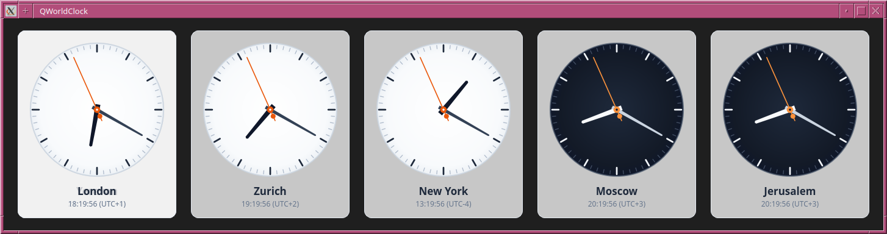
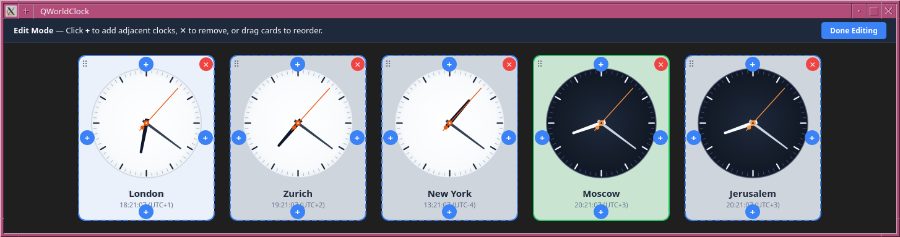
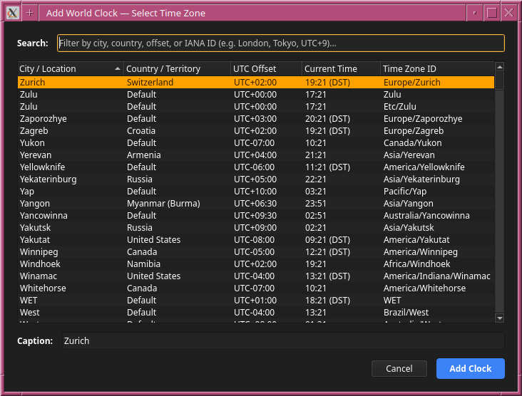
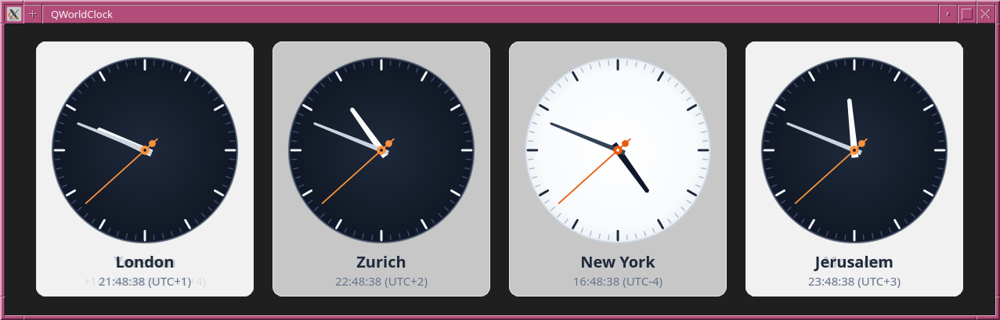

# QWorldClock

[](https://en.wikipedia.org/wiki/C%2B%2B20)
[](https://www.qt.io/)
[](https://cmake.org/)
[]()

A sleek, modern multi-timezone world clock desktop application built with C++20 and Qt 6, designed for distributed engineering teams, remote workers, financial desks, and international operations.



---

## Highlights

- 🕒 **Analog Watchfaces with Day/Night Shading**: Beautiful analog clock dials with continuous hour, minute, and orange second hands. Clocks automatically switch between light dials (business/daylight hours) and dark dials (night/off-hours) so you can tell at a glance whether teammates are online.
- 💼 **Configurable Working Hours**:
  - Global default schedule (e.g. `08:00 - 18:00`, `09:00 - 17:00`, or custom).
  - Per-clock context menu override to match local office schedules, shift rotations, or individual working hours.
  - Dedicated visual configuration dialog with start/end time pickers and quick presets.
- 📐 **Dynamic 2D Grid & Sizing Modes**:
  - Arrange clocks in a flexible 2D grid (rows and columns).
  - **Responsive Mode**: Automatically scales clock dials to optimize viewport space on any screen size.
  - **Fixed Size Mode**: Choose standard diameters (140 px, 190 px, 250 px, 320 px) or enter a custom diameter (100–500 px).
  - Grid alignment options: Left, Center, or Right.
- ✏️ **Interactive Edit Mode (`Ctrl+E`)**:
  - Visually manage your clock dashboard with an interactive editor banner.
  - Four-directional **`+`** buttons on each clock card to add adjacent clocks (Above, Below, Left, Right).
  - **`✕`** button to remove clocks (with single-clock safety protection).
  - Drag-and-drop card reordering with drop highlighting and automatic grid compaction.
- 🌍 **Comprehensive Time Zone Browser**:
  - Instant live filter across all standard IANA time zones.
  - Search by city/location name, country/territory, UTC offset (e.g. `UTC+9`, `-05:00`), or zone ID.
  - Displays current local time and Daylight Saving Time (DST) indicators in real time.
  - Customizable card captions (rename "Europe/London" to "London Office" or "Alice").
- 🔤 **Watchface Caption Font Size Selector**:
  - Global caption font size setting: **Auto (Adaptive)**, **Small (11 px)**, **Medium (14 px)**, **Large (17 px)**, **Extra Large (20 px)**, or **Custom (8–36 px)**.
  - Per-clock font size override accessible via right-click context menu.
- ⚙️ **Persistent TOML Configuration**:
  - Automatic, seamless persistence of window geometry, layout, clocks, display toggles, working hours, and font sizes in human-readable TOML.
- 🎯 **Minimalist & Clean UI**:
  - Toggle seconds hands, day/night shading, menu bar (`Ctrl+M`), and status bar.
  - Full right-click context menu available on every clock card and anywhere on the window.

---

## Screenshots

### Main Window — Day/Night Shading
*Clocks display light dials during local working hours and dark dials at night.*


### Edit Mode & Drag-and-Drop Reordering (`Ctrl+E`)
*Click directional `+` buttons to add adjacent clocks, `✕` to remove, or drag cards to reorder the 2D grid.*


### Time Zone Selection Dialog
*Search by city, country, UTC offset, or IANA ID with real-time DST awareness.*


### Caption Font Size Customization
*Adjust caption font sizes globally or override per watchface for enhanced readability.*


---

## Keyboard Shortcuts

| Shortcut | Action |
| :--- | :--- |
| `Ctrl+E` | Toggle Edit Mode (add / remove / reorder clocks) |
| `Ctrl+M` | Toggle Menu Bar visibility |
| `Ctrl+W` | Configure Global Working Hours |
| `Ctrl+Shift+L` | Align Grid to Left |
| `Ctrl+Shift+C` | Align Grid to Center |
| `Ctrl+Shift+R` | Align Grid to Right |
| `Ctrl+Q` | Exit Application |

---

## Getting Started

### Prerequisites

- **C++20** compatible compiler (GCC 11+, Clang 13+, or MSVC 2022+)
- **Qt 6** (6.5 or later) with `Core`, `Gui`, `Widgets`, and optionally `Test`
- **CMake** (3.22 or later)
- **Ninja** (recommended) or Make
- `tomlplusplus` (automatically fetched via CMake `FetchContent` if not installed)

---

### Building with Pixi (Recommended)

[Pixi](https://pixi.sh) manages dependencies and provides a reproducible environment across platforms:

```bash
# Clone the repository
git clone https://github.com/kgorelov/qworldclock.git
cd qworldclock

# Configure and build
pixi run build

# Run test suite
pixi run test

# Launch the application
pixi run run
```

---

### Building with CMake & Ninja

If building directly with system packages:

```bash
# Configure
cmake -B build -G Ninja -DCMAKE_BUILD_TYPE=Release

# Build
cmake --build build

# Run unit and integration tests
ctest --test-dir build --output-on-failure

# Launch
./build/qworldclock
```

On Windows, Qt runtime dependencies and platform plugins are automatically deployed next to the executable during the build.

---

## Configuration File

QWorldClock stores its settings in a clean, human-readable TOML file located at:
- **Linux**: `~/.config/qworldclock/qworldclock.toml`
- **Windows**: `%APPDATA%\qworldclock\qworldclock.toml`

### Example `qworldclock.toml`

```toml
[app]
version = "1.0.0"
sizing_mode = "responsive"
fixed_clock_size = 190
alignment = "center"
show_menu_bar = true
show_status_bar = true
show_seconds = true
show_day_night = true
caption_font_size = 0
working_hours_start = "08:00"
working_hours_end = "18:00"

[window]
width = 900
height = 650
x = 100
y = 100
maximized = false

[[clocks]]
id = "clock-local"
timezone = "Europe/London"
caption = "London"
row = 0
col = 0
has_custom_working_hours = false
working_hours_start = "08:00"
working_hours_end = "18:00"
has_custom_caption_font_size = false
caption_font_size = 0

[[clocks]]
id = "clock-a1b2c3d4"
timezone = "America/New_York"
caption = "New York"
row = 0
col = 1
has_custom_working_hours = true
working_hours_start = "09:00"
working_hours_end = "17:00"
has_custom_caption_font_size = true
caption_font_size = 14
```

---

## Architecture Overview

```
qworldclock/
├── src/
│   ├── main.cpp                     # Application entry point
│   ├── core/
│   │   ├── TimeEngine.{hpp,cpp}     # Central precision clock timer (100 ms cadence)
│   │   ├── GridModel.{hpp,cpp}      # 2D grid topology, clock items, normalization
│   │   └── ConfigManager.{hpp,cpp}  # TOML serialization, migrations, error fallback
│   └── ui/
│       ├── MainWindow.{hpp,cpp}     # Top-level window, menus, action dispatching
│       ├── ClockGridPanel.{hpp,cpp} # Scrollable 2D card layout, alignment, context menus
│       ├── ClockCardWidget.{hpp,cpp}# Card container, drag-and-drop, edit overlay
│       ├── AnalogClockWidget.{hpp,cpp}# Vector watchface rendering (hands, dial, shading)
│       ├── CaptionLabel.{hpp,cpp}   # High-DPI title and subtitle time/offset renderer
│       ├── TimeZoneDialog.{hpp,cpp} # Filterable IANA time zone table browser
│       └── WorkingHoursDialog.{hpp,cpp} # Visual working hours schedule editor
├── tests/
│   ├── TestGridModel.cpp            # Grid mutations, relative insertions, reordering tests
│   ├── TestConfigManager.cpp        # TOML round-trip serialization and recovery tests
│   └── TestWindow.cpp               # End-to-end window layout, persistence, and override tests
├── doc/
│   └── img/                         # Application screenshots
├── CMakeLists.txt                   # CMake build definition
└── pixi.toml                        # Pixi package and workspace definition
```

---

## License & Authors

Created by **Kirill Gorelov** ([kgorelov@gmail.com](mailto:kgorelov@gmail.com)).
