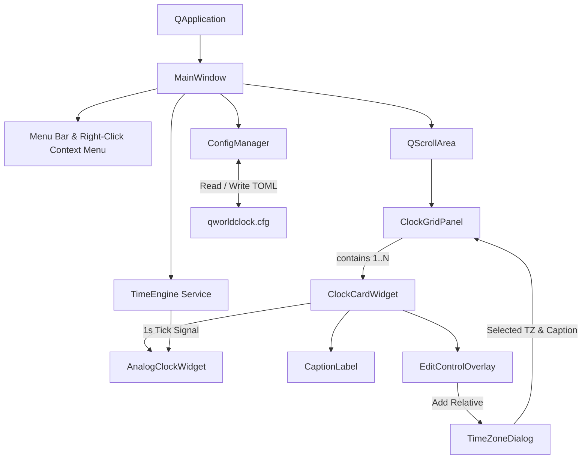

# Technical Implementation Plan: QWorldClock

A modern, cross-platform Qt C++ desktop application providing a multi-timezone world clock grid tailored for globally distributed teams.

---

## 1. Executive Summary & Requirements Overview

Based on [doc/idea.md](file:///home/kgorelov/git/qworldclock/doc/idea.md), **QWorldClock** is designed to help teams across multiple timezones coordinate seamlessly. It presents an intuitive, customizable grid of analog clocks with location captions, dynamic editing capabilities, drag-and-drop reorganization, flexible sizing modes, and persistent TOML configuration.

### Core Functional Requirements
- **Initial State**: Application starts with one clock widget displaying the user's local system time.
- **Directional Clock Addition**: In edit mode, users can add new clocks directly to the **Left**, **Right**, **Above**, or **Below** any existing clock.
- **Timezone Selection**: Adding a clock presents a searchable dialog with IANA timezones, location names, UTC offsets, and custom caption overrides.
- **Clock Reorganization**: Clocks can be dragged and repositioned within the grid during edit mode.
- **Clock Deletion**: Clocks can be removed from the grid; a minimum of one clock is strictly enforced.
- **Clocks Alignment**: Configurable alignment of clocks within the panel/window (**Left**, **Right**, **Center**).
- **Minimalist Clean UI**: No toolbar/toolbox clutter. Menu bar and a comprehensive right-click context menu provide full application control. The menu bar itself can be hidden (`Ctrl+M`) to achieve an ultra-clean, distraction-free clock board.
- **Dual Sizing Modes**:
  1. *Responsive Mode*: Clocks dynamically scale with window resizing while preserving geometry and aspect ratio.
  2. *Fixed-Size Mode*: Clocks maintain a user-defined fixed size (e.g., Small, Medium, Large, or custom px) with auto-wrapping / scrolling.
- **Adaptive Typography**: Caption font size dynamically scales in proportion to the clock widget size to maintain readability without clipping.
- **Configuration Persistence**: Layout and clock settings are stored in TOML format at `~/.config/qworldclock/qworldclock.cfg`.
- **Target Platforms & Toolchain**: Linux and Windows support built with C++20, Qt 6 (Widgets), CMake, and Pixi.

---

## 2. Architecture & Component Hierarchy

The application follows an event-driven Model-View architecture with separation between state management, layout logic, rendering, and persistence.



### Component Breakdown

| Component | Responsibility | Base Class |
| :--- | :--- | :--- |
| `MainWindow` | Top-level window, clean minimalist interface without toolbars, right-click context menu mirroring main menu, toggleable menu bar (`Ctrl+M`), sizing mode switcher, clocks alignment switcher, edit mode toggle, global shortcut handling. | `QMainWindow` |
| `ClockGridPanel` | Manages 2D grid matrix of clocks, relative directional insertion, drag-and-drop events, clocks alignment (Left, Center, Right), and spatial normalization. | `QWidget` / `QGridLayout` |
| `ClockCardWidget` | Container card wrapping the analog clock face, caption label, and edit controls (add buttons, delete button, drag handle). | `QFrame` |
| `AnalogClockWidget` | Renders the analog clock dial, hour/minute/second hands, tick marks, and optional day/night tint via `QPainter`. | `QWidget` |
| `TimeEngine` | Centralized timer service delivering synchronized 1-second ticks to all clock widgets to prevent timer drift and CPU wakeups. | `QObject` |
| `TimeZoneDialog` | Modal dialog featuring an instant search filter over IANA timezones, UTC offsets, current time preview, and custom caption input. | `QDialog` |
| `ConfigManager` | Serialization and deserialization of application settings and clock layout to TOML using `tomlplusplus`. | Class |
| `GridModel` | Pure data model representing cell coordinates `(row, col)`, clock metadata, and layout manipulation algorithms. | Class |

---

## 3. Detailed Subsystem Specifications

### 3.1 Time Handling & The Time Engine
To ensure synchronized hand movements across all clocks without spinning separate timers per widget:
- A single `TimeEngine` emits a `tick(const QDateTime &utcNow)` signal every 1000 ms, aligned to the system second boundary using an initial single-shot alignment timer.
- Each `AnalogClockWidget` caches its target `QTimeZone` (e.g., `Europe/London`, `America/New_York`, or `QTimeZone::systemTimeZone()`).
- On each tick, the widget converts UTC time to target local time via `utcNow.toTimeZone(timeZone)`.
- Calculates hour angle `(hours % 12 + minutes / 60.0) * 30.0°`, minute angle `(minutes + seconds / 60.0) * 6.0°`, and second angle `seconds * 6.0°`.
- Supports displaying a subtle day/night indicator or background tint (e.g., soft dark theme dial for 20:00–06:00, light theme for daytime) to provide instant awareness of colleagues' working hours.

### 3.2 Analog Clock Rendering & Adaptive Typography
- **Rendering via `QPainter`**:
  - Antialiased vector drawing with coordinate transformation centered at `(width/2, height/2)`.
  - Dial radius $R = \min(w, h) / 2 - \text{margin}$.
  - Tick marks: 12 major hour ticks (with optional 1..12 numerals) and 48 subtle minute ticks.
  - Distinct hands: tapered Hour hand, Minute hand, and a contrasting slender Second hand with counterweight and central pivot cap.
- **Adaptive Caption Typography**:
  - Caption displays the location name (e.g., "London", "Tokyo", "Alice (Geneva)") plus relative day offset (`+1d`, `-1d`) if different from local date.
  - Dynamically calculates font pixel size based on card width:
    $$\text{FontSize} = \text{clamp}\left(\left\lfloor \text{Width} \times 0.08 \right\rfloor, 10, 22\right)$$
  - Uses `QFontMetrics::elidedText` if custom location captions exceed available width.

### 3.3 2D Grid Layout & Directional Placement
The grid is modeled as a sparse 2D matrix:
- Each clock has coordinates `(row, col)`.
- **Directional Insertion Algorithm**:
  - When the user selects "Add Clock" relative to a source clock at $(r_0, c_0)$:
    - **Right**: If $(r_0, c_0 + 1)$ is occupied, shift all clocks with $c > c_0$ by $+1$ column. Insert new clock at $(r_0, c_0 + 1)$.
    - **Left**: Shift all clocks with $c \ge c_0$ by $+1$ column. Insert new clock at $(r_0, c_0)$.
    - **Below**: If $(r_0 + 1, c_0)$ is occupied, shift all clocks with $r > r_0$ by $+1$ row. Insert new clock at $(r_0 + 1, c_0)$.
    - **Above**: Shift all clocks with $r \ge r_0$ by $+1$ row. Insert new clock at $(r_0, c_0)$.
  - After any insertion or deletion, the grid executes **Coordinate Normalization** (shifts rows and columns to eliminate completely empty rows/columns starting from index 0).

```
   Existing Grid (2x2)               Insert Below (0, 1)
   [ (0,0): NYC ] [ (0,1): LON ]  -->  [ (0,0): NYC ] [ (0,1): LON ]
   [ (1,0): SFO ] [ (1,1): TYO ]       [ (1,0): SFO ] [ (1,1): PAR ] (New)
                                       [ (2,0): ... ] [ (2,1): TYO ] (Shifted)
```

### 3.4 Drag-and-Drop Reorganization
- In **Edit Mode**:
  - Mouse press and drag threshold ($> 10\text{px}$) on a clock card initiates a `QDrag` event.
  - Drag mime data contains the source clock's unique ID.
  - Other cards accept drop events, displaying a highlight frame or drop indicator.
  - Dropping onto a target card swaps the grid positions $(r_1, c_1) \leftrightarrow (r_2, c_2)$ or inserts and shifts based on drop anchor.
  - Changes immediately persist to the in-memory grid model and trigger an auto-save.

### 3.5 Edit Mode vs. Normal View Mode
- **Normal View Mode**:
  - Clean, distraction-free appearance.
  - Clocks display time and captions. Tooltips reveal exact digital time, UTC offset, and timezone identifier.
  - Resizing respects the active sizing mode.
- **Edit Mode** (toggled via Edit menu, right-click context menu, or `Ctrl+E`):
  - Card borders highlighted with a subtle dashed or accent border.
  - 4 directional "+" buttons appear on the North, South, East, and West edges of each card.
  - A Delete "✕" button appears at the top-right corner of each card (disabled or hidden when only 1 clock remains).
  - Drag handle appears on top-left of each card.
  - A floating or bottom notification displays "Editing Layout — Click '+' to add adjacent clock or drag to reorder. [Done]".

### 3.6 Sizing Modes
1. **Responsive Mode (Geometry-Preserving)**:
   - Clocks expand and contract proportionally with the main window.
   - Layout computes optimal cell sizes while preserving square aspect ratio for the analog face plus fixed-ratio caption bar.
   - Minimum size constraint per clock (e.g., $120\times 150\text{px}$) prevents unreadable minification.
2. **Fixed-Size Mode**:
   - User configures clock dimensions via presets (`Small: 140px`, `Medium: 190px`, `Large: 260px`) or a continuous zoom slider.
   - The grid panel is housed inside a `QScrollArea` with smooth scrolling.
   - Clocks maintain exact pixel dimensions regardless of window resize.

### 3.7 Clocks Alignment (Left, Center, Right)
Users can configure the horizontal alignment of clocks across the panel to suit their desktop workflow and multi-monitor setups:
- **Alignment Modes**:
  - **Left (`Qt::AlignLeft`)**: Clocks cluster against the left margin of the container; surplus horizontal space accumulates on the right.
  - **Center (`Qt::AlignHCenter`)** *(Default)*: Clocks are centered horizontally within the panel/window with equal margin padding on both sides.
  - **Right (`Qt::AlignRight`)**: Clocks cluster against the right margin; surplus horizontal space accumulates on the left.
- **Layout Mechanics**:
  - In **Fixed-Size Mode**: Dynamic horizontal spacers or layout alignment flags on the parent container shift the grid matrix toward the selected anchor within the `QScrollArea` viewport.
  - In **Responsive Mode**: When window dimensions or aspect-ratio constraints produce horizontal margins, alignment dictates whether the clock grid hugs the left edge, centers, or docks to the right edge.
  - **Per-Row Justification**: When a grid layout contains rows with unequal numbers of clocks, alignment also governs whether incomplete rows align to the left, center, or right relative to the wider rows.
- **User Interface & Controls**:
  - **View Menu & Right-Click Context Menu**: A mutually exclusive radio action group: `Alignment -> Left | Center | Right`.
  - **Shortcuts**: `Ctrl+Shift+L` (Left), `Ctrl+Shift+C` (Center), `Ctrl+Shift+R` (Right).
  - Selection updates the layout immediately and is automatically saved to the configuration file.

---

## 4. Configuration Storage & TOML Schema

The configuration file is stored at `~/.config/qworldclock/qworldclock.cfg`.

### Platform Path Resolution
- **Linux**: Resolves `$XDG_CONFIG_HOME/qworldclock/qworldclock.cfg` or fallback to `~/.config/qworldclock/qworldclock.cfg`.
- **Windows**: Resolves `%USERPROFILE%/.config/qworldclock/qworldclock.cfg` (or `%APPDATA%/qworldclock/qworldclock.cfg` with automatic path migration/compatibility).
- Directory creation is handled automatically on first launch if missing.

### TOML File Structure
```toml
[app]
version = "1.0.0"
sizing_mode = "responsive"  # "responsive" or "fixed"
fixed_clock_size = 180       # Clock diameter in pixels for fixed mode
alignment = "center"         # "left", "center", or "right"
show_menu_bar = true         # Set false to hide menu bar for clean UI (Ctrl+M / right-click to restore)
show_status_bar = true
show_seconds = true
show_day_night = true
dark_theme = "auto"          # "auto", "light", "dark"

[window]
width = 900
height = 650
x = 150
y = 120
maximized = false

[[clocks]]
id = "clock-local"
timezone = "Local"           # Special keyword for system local timezone
caption = "My Office"
row = 0
col = 0

[[clocks]]
id = "clock-london"
timezone = "Europe/London"
caption = "London"
row = 0
col = 1

[[clocks]]
id = "clock-tokyo"
timezone = "Asia/Tokyo"
caption = "Tokyo HQ"
row = 1
col = 0

[[clocks]]
id = "clock-sf"
timezone = "America/Los_Angeles"
caption = "San Francisco"
row = 1
col = 1
```

---

## 5. Technology Stack & Build System

### 5.1 Technology Choices
- **C++ Standard**: C++20 (clean chrono, string formatting, modern algorithms).
- **GUI Framework**: Qt 6 (Widgets, Core, Gui).
- **TOML Library**: `tomlplusplus` (header-only or prebuilt, zero-dependency C++20 TOML parser/serializer).
- **Build Generator**: CMake 3.22+.
- **Package & Environment Manager**: Pixi (using `conda-forge` packages for identical cross-platform builds on Linux and Windows).

### 5.2 Pixi Project Configuration (`pixi.toml`)
```toml
[workspace]
name = "qworldclock"
version = "0.1.0"
description = "Multi-timezone world clock desktop application for distributed teams"
authors = ["Kirill Gorelov <kgorelov@gmail.com>"]
channels = ["conda-forge"]
platforms = ["linux-64", "win-64"]

[dependencies]
cmake = ">=3.22"
ninja = ">=1.11"
cxx-compiler = ">=13.0"
qt6-main = ">=6.5"
tomlplusplus = ">=3.3"

[tasks]
configure = "cmake -B build -G Ninja -DCMAKE_BUILD_TYPE=Release"
build = "cmake --build build"
test = "ctest --test-dir build --output-on-failure"
run = "./build/qworldclock"
```

### 5.3 CMake Build Configuration (`CMakeLists.txt`)
- Enables `CMAKE_AUTOMOC`, `CMAKE_AUTORCC`, `CMAKE_AUTOUIC`.
- Configures strict compiler warnings (`-Wall -Wextra -Wpedantic` / `/W4`).
- Targets:
  - `qworldclock_core` (static library: models, config, timezone logic, testable without GUI display).
  - `qworldclock` (GUI executable).
  - `qworldclock_tests` (QtTest test suite).

---

## 6. Project Directory Structure

```
qworldclock/
├── CMakeLists.txt
├── pixi.toml
├── doc/
│   ├── idea.md
│   └── implementation_plan.md
├── resources/
│   ├── icons/
│   │   ├── app.svg
│   │   ├── add.svg
│   │   ├── delete.svg
│   │   ├── drag.svg
│   │   └── edit.svg
│   └── qworldclock.qrc
├── src/
│   ├── main.cpp
│   ├── core/
│   │   ├── ConfigManager.hpp
│   │   ├── ConfigManager.cpp
│   │   ├── GridModel.hpp
│   │   ├── GridModel.cpp
│   │   ├── TimeEngine.hpp
│   │   └── TimeEngine.cpp
│   └── ui/
│       ├── MainWindow.hpp
│       ├── MainWindow.cpp
│       ├── ClockGridPanel.hpp
│       ├── ClockGridPanel.cpp
│       ├── ClockCardWidget.hpp
│       ├── ClockCardWidget.cpp
│       ├── AnalogClockWidget.hpp
│       ├── AnalogClockWidget.cpp
│       ├── EditOverlayWidget.hpp
│       ├── EditOverlayWidget.cpp
│       ├── TimeZoneDialog.hpp
│       └── TimeZoneDialog.cpp
└── tests/
    ├── CMakeLists.txt
    ├── TestConfigManager.cpp
    ├── TestGridModel.cpp
    └── TestTimeEngine.cpp
```

---

## 7. Step-by-Step Implementation Roadmap


### Phase 1: Environment & Project Scaffolding
- Define `pixi.toml` with dependencies: `cmake`, `ninja`, `cxx-compiler`, `qt6-main`, `tomlplusplus`.
- Create root `CMakeLists.txt` with compiler flags, Qt 6 link targets, and test setup.
- Implement skeletal `main.cpp` and empty `MainWindow` to verify toolchain execution.

### Phase 2: Core Clock Widget & Time Engine
- Implement `TimeEngine` with 1-second pulse and second-boundary alignment.
- Implement `AnalogClockWidget` using `QPainter`:
  - Vector rendering of dial, ticks, hour/minute/second hands.
  - Smooth antialiased geometry.
  - Day/night tint rendering based on current hour in target timezone.
- Implement `CaptionLabel` with dynamic font scaling calculated from widget dimensions.

### Phase 3: Grid Layout & Relative Directional Insertion
- Implement `GridModel` managing `(row, col)` coordinates and shifting algorithms for:
  - Add to Right
  - Add to Left
  - Add Above
  - Add Below
- Implement `ClockGridPanel` hosting `QGridLayout`.
- Connect grid events to recalculate positions and update visual layouts.
- Enforce the "minimum 1 clock" rule (delete option disabled if count == 1).

### Phase 4: Edit Mode & Drag-and-Drop Interaction
- Create `EditOverlayWidget` containing directional '+' buttons on cardinal edges and '✕' delete button on top-right.
- Implement Edit Mode toggle in `MainWindow` (Edit menu, context menu, `Ctrl+E`).
- Implement Qt Drag-and-Drop (`QDrag`, `QDropEvent`) on `ClockCardWidget`.
- Add visual drop indicators and position swapping.

### Phase 5: Timezone Selection Dialog
- Implement `TimeZoneDialog` querying `QTimeZone::availableTimeZoneIds()`.
- Populate searchable list with city name, country, UTC offset, and live preview time.
- Provide real-time `QLineEdit` filter for instant lookup.
- Include custom caption field defaulting to the selected city name.

### Phase 6: Sizing Modes, Alignment & Adaptive Window Layout (Completed)
- [x] Implement **Responsive Mode**:
  - Clocks scale uniformly with window resize, maintaining 1:1 dial aspect ratio.
  - Dynamically calculates optimal card size clamped to viewport dimensions to eliminate clipping.
- [x] Implement **Fixed-Size Mode**:
  - Embed `ClockGridPanel` in `QScrollArea`.
  - Add size presets in menu (`Small (140px)`, `Medium (190px)`, `Large (250px)`, `Extra Large (320px)`, `Custom...`).
- [x] Implement **Clocks Alignment** (Left, Center, Right):
  - Add mutually exclusive alignment actions to View menu and Right-Click Context Menu (`Ctrl+Shift+L/C/R`).
  - Implement dynamic container layout alignment in `ClockGridPanel` to justify clocks left, center, or right.
- [x] Verify adaptive typography transitions smoothly without clipping.
- [x] Verified via `WindowTest` test suite and visual headless grab.

### Phase 7: Configuration Persistence (TOML) (Completed)
- [x] Implemented `ConfigManager` reading and writing `~/.config/qworldclock/qworldclock.cfg` using `tomlplusplus`.
- [x] Automatic default configuration creation on first launch (defaults to 1 local clock, responsive mode, center alignment).
- [x] Saves and restores:
  - Window geometry (`width`, `height`, `x`, `y`, `maximized`).
  - UI visibility states (`show_menu_bar`, `show_status_bar`).
  - View settings (`show_seconds`, `show_day_night`).
  - Sizing mode, fixed clock dimension, and clocks alignment setting (`left`, `center`, `right`).
  - Ordered list of clocks with IDs, timezone names, custom captions, and `(row, col)` positions.
- [x] Auto-save wired to clock addition, removal, reordering, alignment changes, sizing changes, visibility toggles, window close, and application quit.
- [x] Verified unit tests in `TestConfigManager` and full end-to-end multi-session persistence in `TestWindow`.

### Phase 8: Testing, Cross-Platform Verification & CI/CD Packaging (Completed)
- [x] **Unit Testing**:
  - `TestConfigManager`: TOML parsing, serialization, invalid config recovery.
  - `TestGridModel`: Shifting algorithms for all 4 directions, normalization, single-clock constraint.
  - `TestTimeEngine`: Singleton lifecycle, tick signals, timezone offset calculations, day rollover logic.
  - `TestWindow`: End-to-end window layout, responsive scaling, and persistence tests.
- [x] **Cross-Platform Verification**:
  - Linux: Clean headless test execution with `QT_QPA_PLATFORM=offscreen`, standard XDG configuration storage.
  - Windows: Automatic runtime dependency and Qt platform plugin deployment next to executable.
- [x] **GitHub Automated Builds & Releases**:
  - Configured `.github/workflows/release.yml` with Pixi and GitHub Actions.
  - Triggers on tag pushes and manual `workflow_dispatch`.
  - Matrix builds and tests across Ubuntu (`linux-x64`) and Windows (`windows-x64`).
  - Automatically packages and attaches `qworldclock-<tag>-linux-x64.tar.gz` and `qworldclock-<tag>-windows-x64.zip` to GitHub Releases.

---

## 8. Verification & Acceptance Criteria

| Feature | Acceptance Criteria |
| :--- | :--- |
| **First Run Experience** | Starts immediately with exactly 1 clock showing local system time and correct caption. |
| **Clean Minimalist UI** | No toolbars or clutter; full right-click context menu mirrors all options; menu bar can be hidden via `Ctrl+M` or context menu. |
| **Directional Adding** | Clicking '+' on Right, Left, Top, or Bottom opens timezone picker and inserts new clock at the exact relative coordinate, shifting neighbors if needed. |
| **Timezone Picker** | Fast search filter over all IANA zones; displays current time and UTC offset; allows custom caption override. |
| **Drag & Drop** | In edit mode, dragging clock onto another swaps or shifts positions; persists across restarts. |
| **Single Clock Guard** | When only 1 clock remains, delete button is disabled/hidden; user cannot delete the last clock. |
| **Clocks Alignment** | Switching between Left, Center, and Right immediately realigns the clocks within the window; persists across application restarts. |
| **Dual Sizing** | Responsive mode scales widgets when resizing window; Fixed mode keeps exact pixel sizes and enables scrolling. |
| **Font Scaling** | Caption font dynamically increases/decreases with clock size; no text clipping or overlap. |
| **Configuration** | Settings persist to `~/.config/qworldclock/qworldclock.cfg`; valid TOML format; restores exact layout and visibility states on restart. |
| **Build Reproducibility** | Builds cleanly via `pixi run build` and runs via `pixi run run` on both Linux and Windows. |
